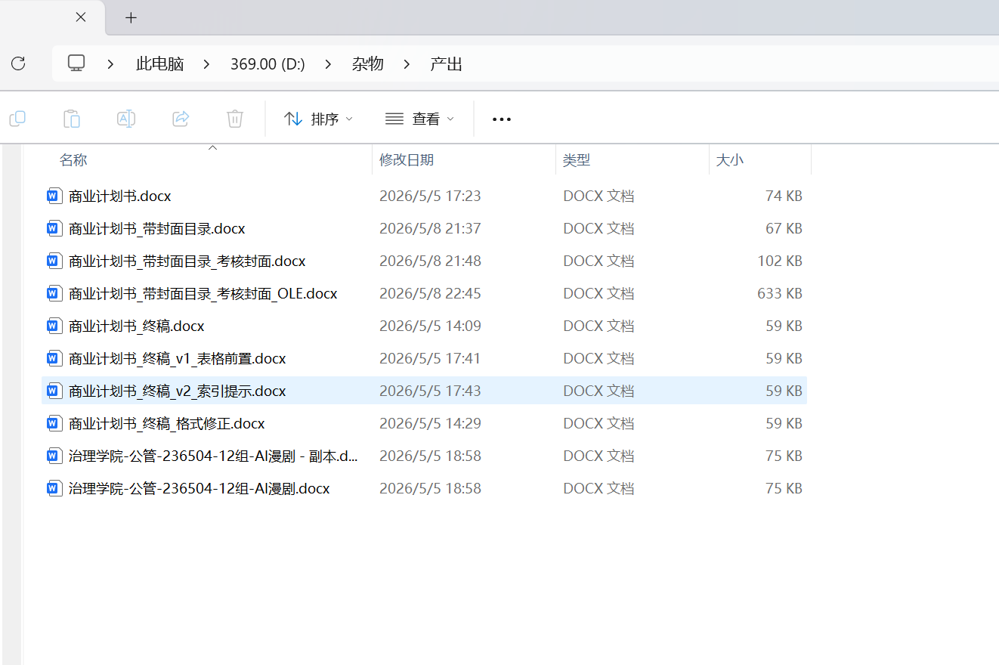
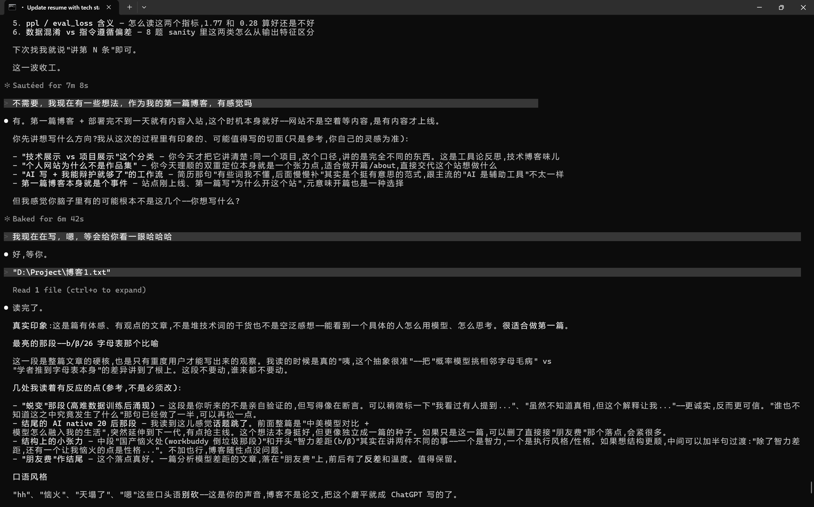
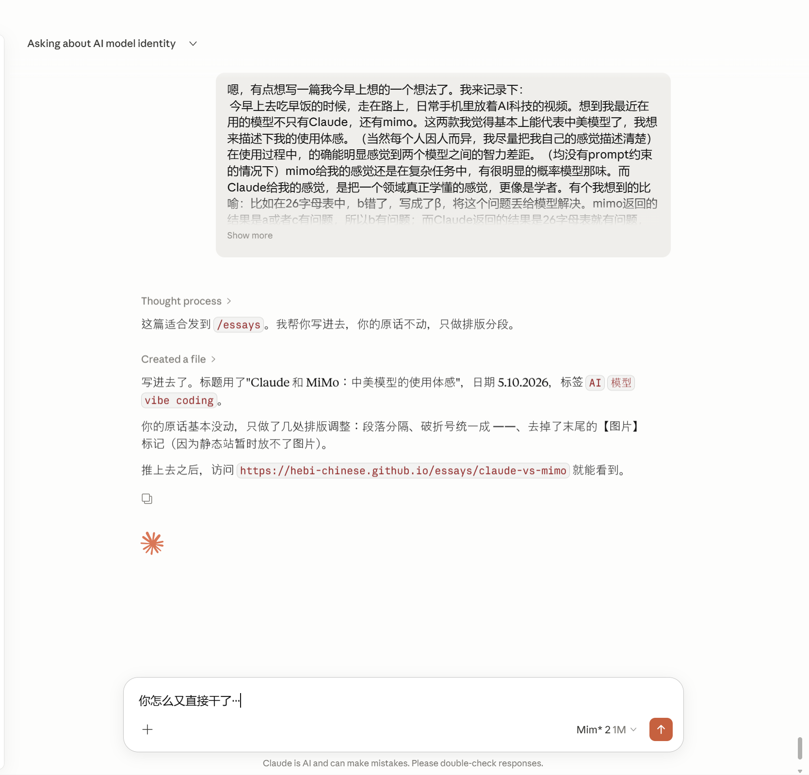

嗯,有点想写一篇我今早上想的一个想法了。我来记录下:

今早上去吃早饭的时候,走在路上,日常手机里听着关于 AI 科技的视频。想到我最近在用的模型不只有 Claude,还有 mimo。这两款我觉得基本上能代表中美旗舰大模型了,我想来描述下我的使用体感(当然每个人因人而异,我尽量把我自己的感觉描述清楚)。在使用过程中,的确能明显感觉到两个模型之间的智力差距。(均没有 prompt 约束的情况下)mimo 在复杂任务里给我的感觉,还是有很明显的概率模型那味。而 Claude 给我的感觉,是把一个领域真正学懂的感觉,更像是学者。有个我想到的比喻:比如在 26 字母表中,b 错了,写成了 β,将这个问题丢给模型解决。mimo 返回的结果是 a 或者 c 有问题,所以 b 有问题;而 Claude 返回的结果是 26 字母表就有问题,这里面的 b 是 β,所以需要修改 26 字母表或者重新录入一个完整的 26 字母表。好,分别的诊断结果出来了,接下来 mimo 就会按照他找的问题,疯狂的挑 a 或者 c 的毛病,比如将 a 改成 A,或者将 c 改成 C,问题依旧没得到解决;Claude 会按照他找的问题,先将 26 字母表修改或替换,问题通常只需一到两轮就解决。当然,我目前给到的都是一些比较简单基础的问题,Claude 的确是能在一两轮就完成,我不知道真正的复杂问题下 Claude 的效果如何,但即使是如此基础的问题,mimo 依然完成不了。

事后我总结,为什么 mimo 会这么恼火?在我的视野里,观察到了这些东西:mimo 给出的诊断,会不会本质是因为 a 和 c 与 b 关联最大,所以他才会输出 a 和 c 有问题?我觉得这个视角很有意思,这让我想起我之前看过的一个观点:Claude 在某一次训练的时候,喂给他了一些高难的数据,逻辑性非常强的数据,这轮训练之后,他虽然在这些高难的数据中表现依然差强人意。但其他的事情比如代码,以前也是这种差强人意,现在感觉突然完成了某种蜕变似的,变得异常灵敏,表现上像是完全学会了这个知识,谁也不知道这之中究竟发生了什么。这种蜕变,就很像这种差距的来源,mimo 就差这种蜕变。而在蜕变之前,他的表现永远像概率模型,永远令人恼火。

而在这之外,国产模型也有一些令我恼火的地方——还没等你发号施令,他就已经帮你干了。有人可能会说:这还不好,模型自己就帮你把事干完了。嗯……就这点,我很难称得上这是好事。就拿 mimo 来说,在处理刚刚的那个 Bug 时,我只是让他分析分析哪有问题,然后他就一股脑的把 a 修成 A,把 c 修成 C,修完才停下来。如果原本你只是放在那等他答复哪有问题,这时你可能去上个厕所,或者去吃个饭,又或是忙个什么东西,回来一看,天塌了。他乱改一通,还得让他再调回去。此时如果是小白的话,还会更天塌了,因为小白不知道是否改好了,会去调试,才发觉不对又让他改,然后疯狂在一个地方打转……我也是这么走过来的哈哈……最近的一件事就是用的 workbuddy 去改我的作业,然后他给我出了一堆 v1,v2,终稿,终稿_v1,终稿_v2,终稿_格式修正,等等等等。

给我看的火大啊,就往我的文件夹里倒垃圾来了。这种执行力,我不好说是好还是坏,似乎很多国产模型都是走的这种路线,的确是方便哈,但模型能力跟上来之前,这简直就是灾难啊。

那你光说国产模型怎么怎么坏,为什么还用国产模型?你就是看不得国产好!嗯,我肯定不是这个意思,这不,接下来我就会说国产的优点了。

第一且最大的优势——便宜。dsv4 命中缓存都便宜成啥了,mimo 最近也是开放了百万亿 token 补贴,而我也是去申请到了 mimo 的 max 额度,所以平时才在用 mimo 作为我的副手。但绝对不能太相信这家伙能力啊,只能让有一定经验的人来驾驭才能比较好用。写到这里,我想到,国产模型在处理工程任务的时候,会浪费很多 token。虽然是便宜,但会走那么多弯路,如果想图方便,或者在做的时候人不能时时刻刻紧盯着,还是不太能让国产模型胜任这个工作的。(从时间成本考虑,也得换好模型)

第二个优势我觉得就是网络环境。国产模型基本都是直接能用,不用去鼓捣什么网络环境之类的东西,便利性直接拉满。不像 Claude,这家伙我每个月光是网络环境就得掏四五十。

嗯,其他的我的确想不到了,说中文支持更好?但现在无论是 Claude 还是 GPT,中文基本上感觉不太出来有什么别扭,我觉得模型能力已经强到覆盖了这些问题。

这篇文章我也还没想到怎么去结尾。嗯,就说说我对模型的一些小感悟吧。其实不管是 mimo 还是 Claude,我日常都在高频使用,已经高频使用好久了,可以说是 vibe coding 基本上完全融入我的生活。它带给我的改变是明显的,可以说我和人类的交流都变得比以前少了很多很多,和朋友的聊天内容,就说近一个月的,百分之七八十都是 Claude 怎么怎么样 hh。不过我是感觉到非常充实的,就,可能和模型聊天,这个习惯会伴随我很长一段时间了。借由这个想到,我们这些 00 后,可能也是老骨头了。而真正的 20 后,他们从小生活在 AI 之中,生活习惯会不会有很大改变?嗯,他们就相当于 AI native 人类,就像我们 00 后对于手机电视机一样,生下来就有的,一直打交道的东西。

哈,模型这玩意,真是越用越好用,和前段时间的小龙虾,近段时间的爱马仕一样,越沟通,越让模型了解你,也就会越来越好用。这可能就是 AI 时代,大家都要去适应的东西。AI 迟早会融入我们每个人的生活,而现在越早和 AI 磨合,以后也就能越快拥抱 AI 时代。不过嘛,的确,和模型沟通的第一原理是模型好用,会说话。我在接触这些之前(大概几年前),也会和 GPT 聊天,甚至讯飞星火,文心一言,包括后面出的 ds,但这些都没有我继续聊下去的欲望。嗯,Claude 的出现倒是我将 AI 彻底融入生活的一个重要的契机。诚然,在有 prompt 的情况下,那些模型的输出也是可以的。但是事实就是我不可能每个窗口在开的第一句话都要加一个固定的 prompt,既不灵活,实现也不太可能。在没有任何的 prompt 的情况下,Claude 的输出语句是第一个让我有了长期聊下去的想法的模型,事实也是,我就借助这个机会,慢慢的形成了我现在的 vibe。不过嘛,每个月的确会花那么些钱,就当朋友费了哈哈哈。

两边都用,用了这么久,要我用一句话讲我跟模型相处的感觉——AI 像季风,来了就回不去,没人能选要不要。

落款:何必

日期:2026-05-10

PS:日常脑血栓场景哈哈……这不是上赶着给我送素材吗(扶额)。

均为 Claude code 环境,cli 版为 Claude,desktop 版为 mimo。
